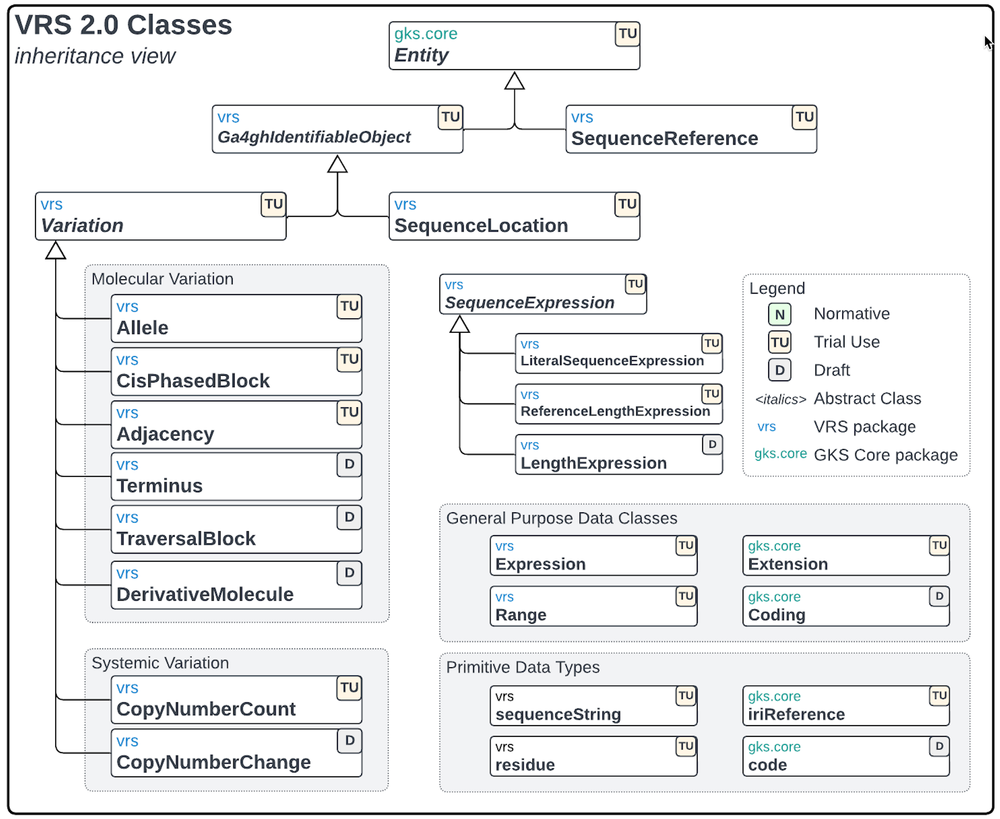

.. _ClassDiagram:

Class Diagram
!!!!!!!!!!!!!

Below is a class diagram of the VRS schema which provides a visual representation
of the class inheritance only, not associations. Each class within the diagram is
tagged with the maturity level of the class in the upper right corner. The maturity
levels are defined in the :ref:`feature-maturity-levels` section.

   Current VRS Class Inheritance Diagram
